# Projeto Eletrônico do Juca

  
O Juca é a placa eletrônica propriamente dita, conforme observado na [Figura 1](#juca_board) e [Figura 2](#juca_board_back). Ela possui 180 mm x 125 mm, composta de duas camadas, com objetivo de ser robusta. 

  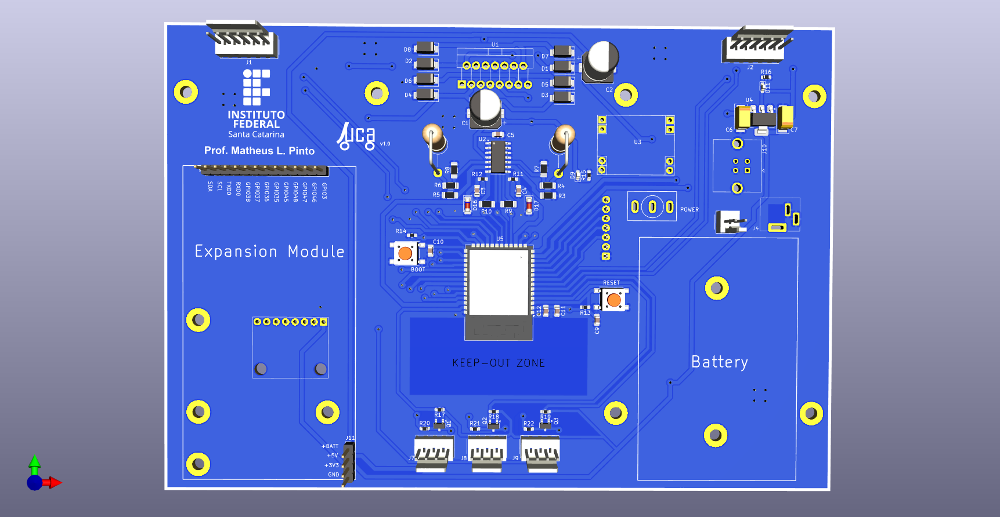
   
  <i>Figura 1: Visão 3D da parte superior da placa Juca.</i>

  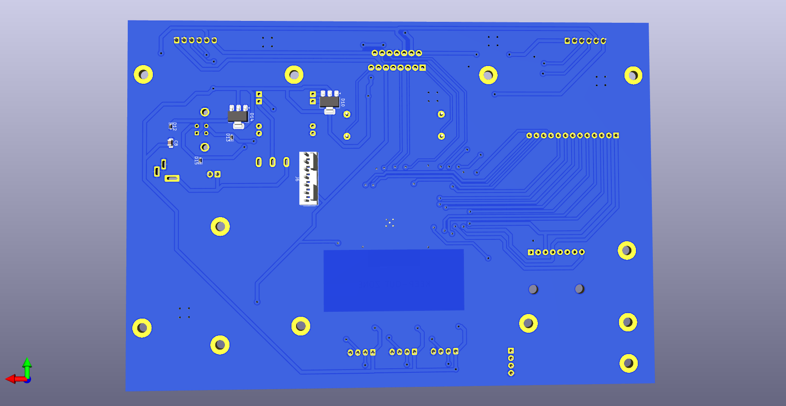
   
  <i>Figura 2: Visão 3D da parte inferior da placa Juca.</i>

Na [Figura 3](#juca_diagram) é apresentado o diagrama de blocos do Juca. Serão apresentados cada módulo presente no sistema.

  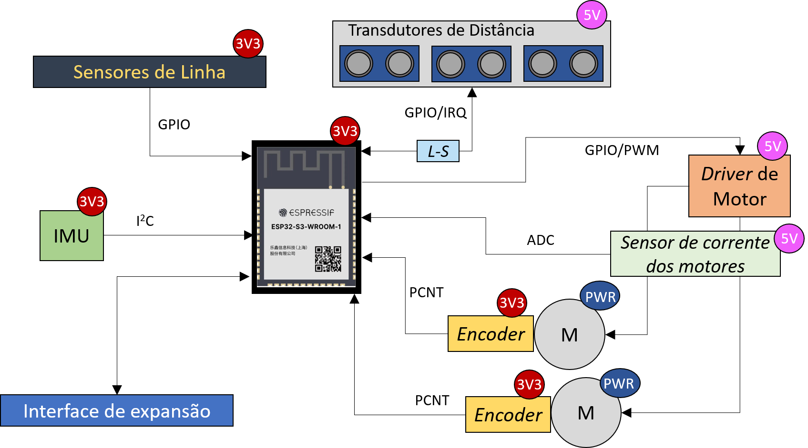
   
  <i>Figura 3: Diagrama de blocos didático do sistema.</i>

---

## Microcontrolador (SoC)

O sistema utiliza o SoC **ESP32-S3-WROOM-1**, aproveitando suas capacidades de processamento dual-core e capacidade de comunicação por Wi-fi e BLE. O esquemático relacionado a esse módulo encontra-se na [Figura 4](#esp32_s3_sch).
O ESP32-S3 têm picos de consumo de corrente muito rápidos (especialmente ao ligar o Wi-Fi). Os capacitores (C11 e C12) próximos aos pinos de alimentação (`3V3`) filtram ruídos de alta frequência e evitam que a tensão caia momentaneamente, o que causaria resets inesperados.

  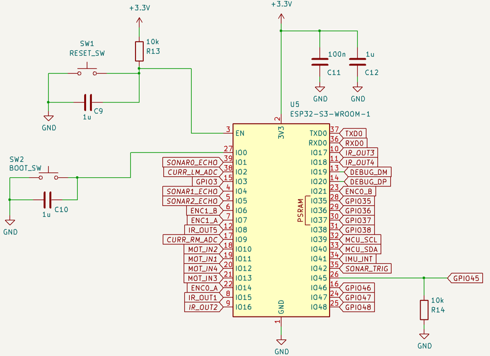
   
  <i>Figura 4: Esquemático módulo ESP32-S3-WROOM-1.</i>

**R13 (10k Pull-up no EN):** Mantém o pino de Enable (Reset) em nível alto (3.3V) para que o chip opere de maneira normal quando o pushbutton SW1 não for pressionado. O botão SW1, ao ser pressionado, aterra esse pino para resetar a MCU.

**R14 (10k Pull-down no GPIO45):** Este é um **resistor de configuração (Strapping Pin)**. Ele garante que o pino 45 esteja em 0V durante o boot, informando ao ESP32-S3 que a memória Flash interna opera a **3.3V**. Sem ele, o chip poderia tentar alimentar a memória com 1.8V, impedindo a inicialização.

Toda gravação de firmware e comunicação com o chip é feita diretamente por meio da interface USB implementada diretamente no ESP32-S3 ([Figura 5](#usb_sch)), através dos pinos GPIO19 (DEBUG_DM) e GPIO20 (DEBUG_DP).

  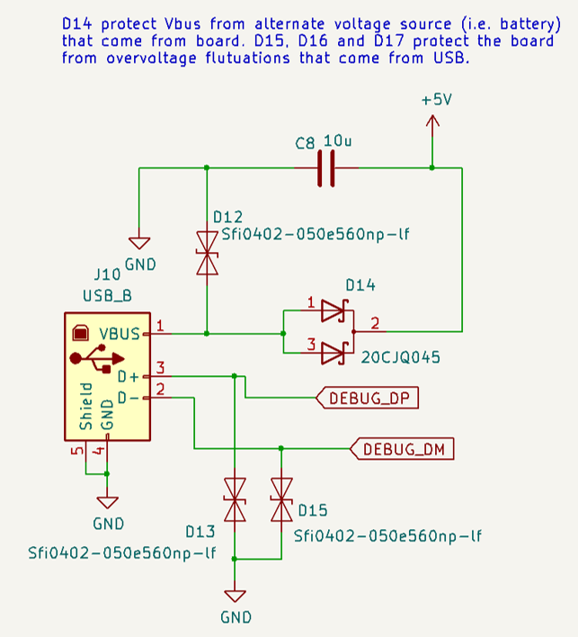
   
  <i>Figura 5: Interface USB de conexão com o ESP32-S3.</i>

---

## Alimentação

O hardware possui três barramentos principais de alimentação ([Figura 7](#power_sch)):

1.  **+BATT (Potência):** 6V a 12V para os motores e alimentação geral do sistema. Essa alimentação pode advir de uma bateria (por meio do conector J3) ou de uma fonte CC externa conectada por um por jack-cc (J4). Um interruptor (SW3) é responsável por conectar a bateria/fonte ao restante da placa. Se bateria e fonte estiver conectadas no sistema, a fonte externa poderá carregar a bateria. Note que a placa não possui BMS, dessa forma será necessário utilizar no próprio pack de bateria um BMS.

2. **5V (Lógica):** Gerado por um conversor *buck* bastante utilizado em projetos de eletrônica hobistas (Figura) ou pela interface USB ([Figura 6](#buck_il_2825)). Cria uma barramento de 5V para alimentar dispositivos externos, e para alimentar o driver de motor e o sensores ultrassônicos. Se alimentação vier do USB (sem fonte +BATT), o driver de motor é acionado, mas os motores não.

  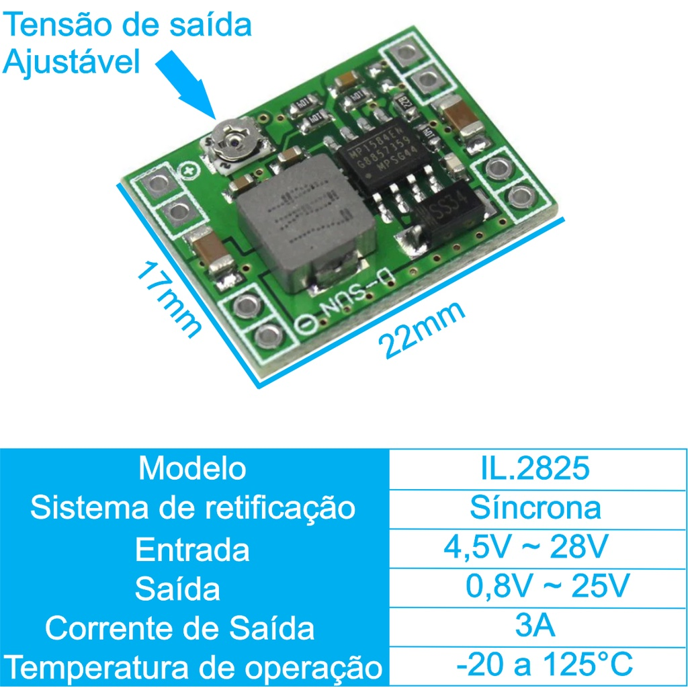
   
  <i>Figura 6: Mini placa para buck IL 2825.</i>

3.  **3.3V (Lógica):** Gerado por um regulador LDO (como o AMS1117) para alimentar o ESP32-S3 e o restantes dos sensores.

  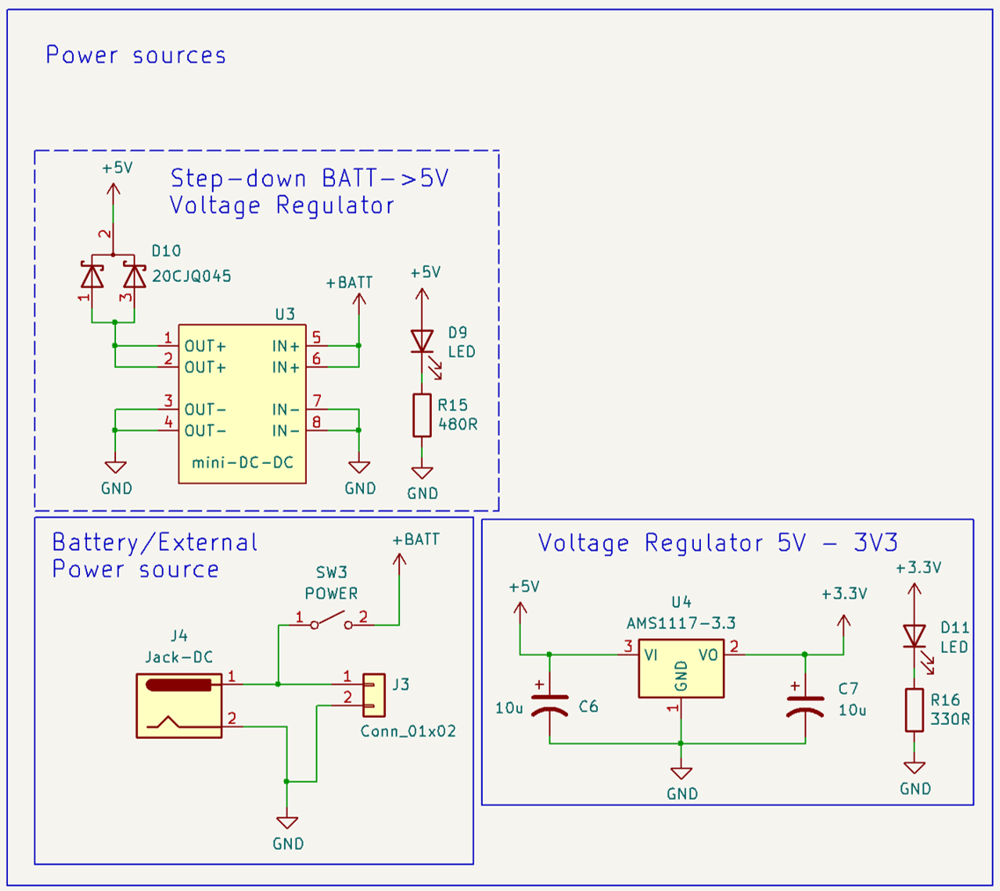
   
  <i>Figura 7: Módulos de alimentação da placa.</i>

---
## *Driver* de motores

Para acionamento dos motores por meio do PWM, utilizou-se o chip L298N. Esse módulo possui uma ponte H para controle de direção e amplificação da potência nos motores. Um diagrama do circuito do L298N retirado do seu datasheet é apresentado na [Figura 8](#l298N). O esquemático do driver desenvolvido com o chip é apresentado na [Figura 9](#mot_driver_sch).

  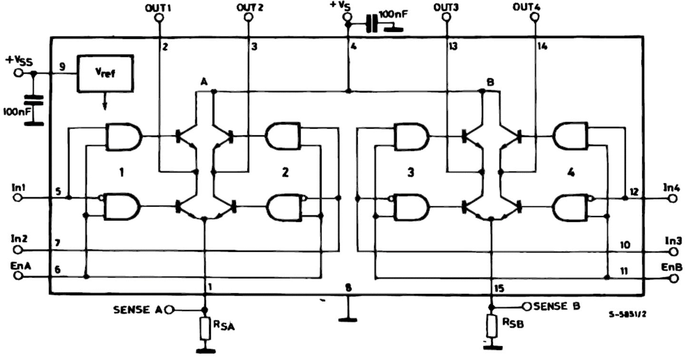
   
  <i>Figura 8: Diagrama do circuito interno do L298N.</i>

  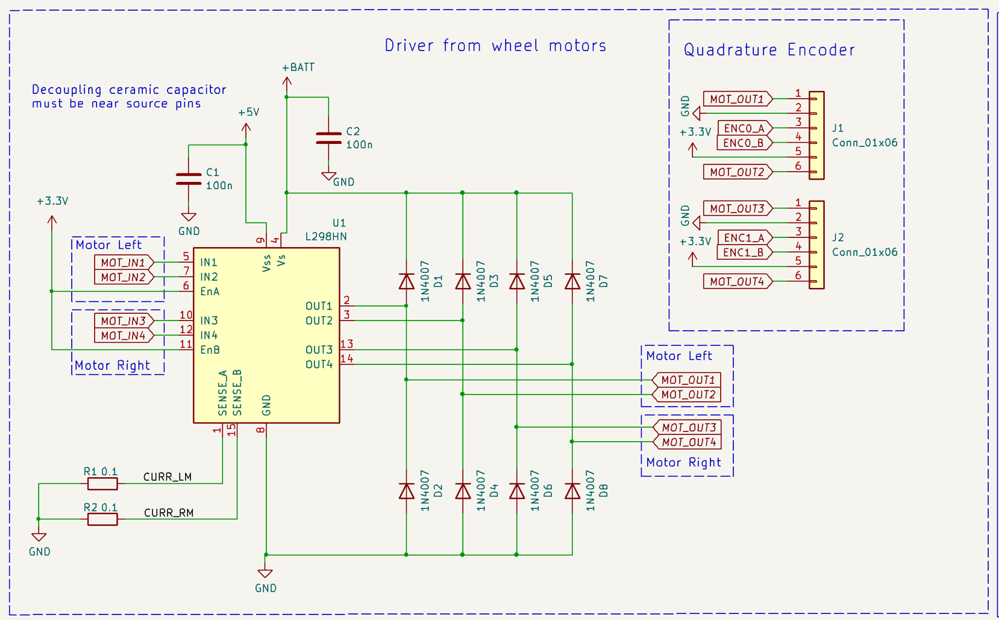
   
  <i>Figura 9: Esquemático do circuito driver de motor do Juca.</i>

A placa foi pensada usando um motor com as seguintes especificações (mas facilmente adaptado para outros tipos de motor, mudando valores de tensão de alimentação da bateria e/ou mudando alguns valores de resistores no circuito de sensor de corrente):

|**Parâmetro**|**Valor / Especificação**|
|---|---|
|**Tensão de Operação**|6V DC|
|**Velocidade (Sem Carga)**|280 RPM|
|**Máxima Eficiência**|2.0 kg.cm @ 170 RPM|
|**Potência na Máx. Eficiência**|2.0 W|
|**Corrente na Máx. Eficiência**|0.60 A|
|**Torque de Partida (Stall)**|5.2 kg.cm @ 110 RPM|
|**Potência Máxima**|3.1 W|
|**Corrente de Pico (Stall)**|1.10 A|
|**Diâmetro do Motor**|25 mm|
|**Comprimento Total (Corpo + Eixo)**|73 mm|
|**Diâmetro do Eixo**|4 mm|
|**Comprimento do Eixo**|12 mm|

O motor utilizado a priori é daqueles se acham facilmente em lojas online de materiais eletrônicos, possuindo integrado um *encoder* de quadratura a efeito hall, conforme [Figura 10](#motor_wire)

  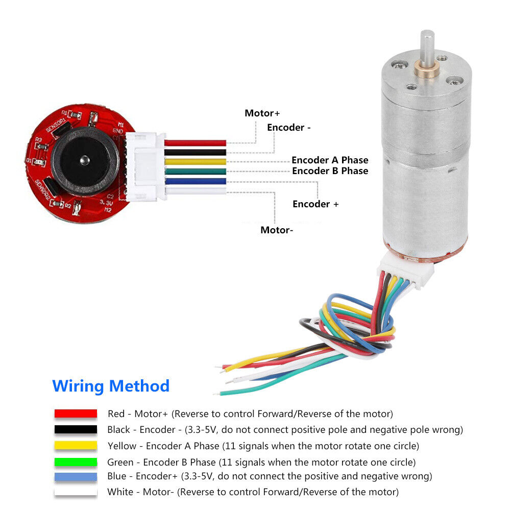
   
  <i>Figura 10: Motor com encoder utilizado.</i>

Com base nas combinações dos pinos MOT_IN1, MOT_IN2, MOT_IN3 e MOT_IN4, pode-se determinar o controle de direção e velocidades das rodas. Note que quando todos os pinos estiverem em ALTO, as rodas irão travar eletronicamente, pois as portas lógicas SUPERIORES do driver ([Figura 8](#l298N)) irão forçar os polos do motor ao mesmo potencial elétrico (Vcc). Da mesma forma, quando todos os pinos estiverem em BAIXO, as rodas irão travar eletronicamente, pois as portas lógicas INFERIORES do driver ([Figura 8](#l298N)) irão forçar os polos do motor ao mesmo potencial elétrico (GND). Infelizmente, nesse projeto não há possibilidade de deixar as rodas em ponto morto, sem torque (deixar as rodas desconectadas), pois os pinos de habilitação (EnA e EnB) foram deixadas diretamente conectadas do +3V3.

| **Direção Desejada**  | **MOT_IN1** | **MOT_IN2** | **MOT_IN3** | **MOT_IN4** | **Efeito Prático**                       |
| --------------------- | ----------- | ----------- | ----------- | ----------- | ---------------------------------------- |
| **Frente**            | PWM         | Low         | PWM         | Low         | Ambas as rodas giram para frente         |
| **Trás**              | Low         | PWM         | Low         | PWM         | Ambas as rodas giram para trás           |
| **Girar p/ Direita**  | PWM         | Low         | Low         | PWM         | Roda esquerda p/ frente, direita p/ trás |
| **Girar p/ Esquerda** | Low         | PWM         | PWM         | Low         | Roda direita p/ frente, esquerda p/ trás |
| **Curva p/ Direita**  | PWM         | Low         | Low         | Low         | Apenas roda esquerda gira                |
| **Curva p/ Esquerda** | Low         | Low         | PWM         | Low         | Apenas roda direita gira                 |
| **Freio (Ativo)**     | Low         | Low         | Low         | Low         | Motores travam eletronicamente           |
| **Freio (Ativo)**     | High        | High        | High        | High        | Motores travam eletronicamente           |

Além do acionamento dos motores, o módulo de driver de motores fornece a corrente dos motores por meio de dois pinos SENSE_A e SENSE_B. Essas correntes são aplicadas a resistores de *shunt* de 0,1 Ohm PTH do tipo filme de carbono de 2 Watts (no limiar de potência para os motores), por serem fáceis de serem achadas comercialmente no Brasil. Sabendo a resistência dos _shunts_ e medindo a tensão dos mesmos por meio de do ADC no SoC, aplica-se a Lei de Ohm e se obtém a corrente.. Posto isto, os valores de queda de tensão que surgem nesses resistores são muito pequenos, devendo ser necessário um circuito de amplificação (que será abordado posteriormente). 

O módulo também possui uma interface para entrada de encoders de quadratura. Essa parte será abordada mais adiante também, pois também serão apresentados os encoders utilizados. 

---
## Sensor de corrente dos motores

Para monitorar a carga dos motores e detectar obstáculos ou travamentos (stall), o projeto utiliza um circuito de amplificação baseado no AmpOp **LM324A** ([Figura 11](#curr_sense_sch)). O circuito utiliza a queda de tensão sobre os resistores de shunt (R1​ e R2​ de 0.1Ω em [Figura 9](#mot_driver_sch)) localizados nos pinos de _Sense_ do driver L298N. Como essa tensão é muito baixa para uma leitura precisa pelo ADC, aplicamos um **Amplificador Não-Inversor** a cada uma delas.

  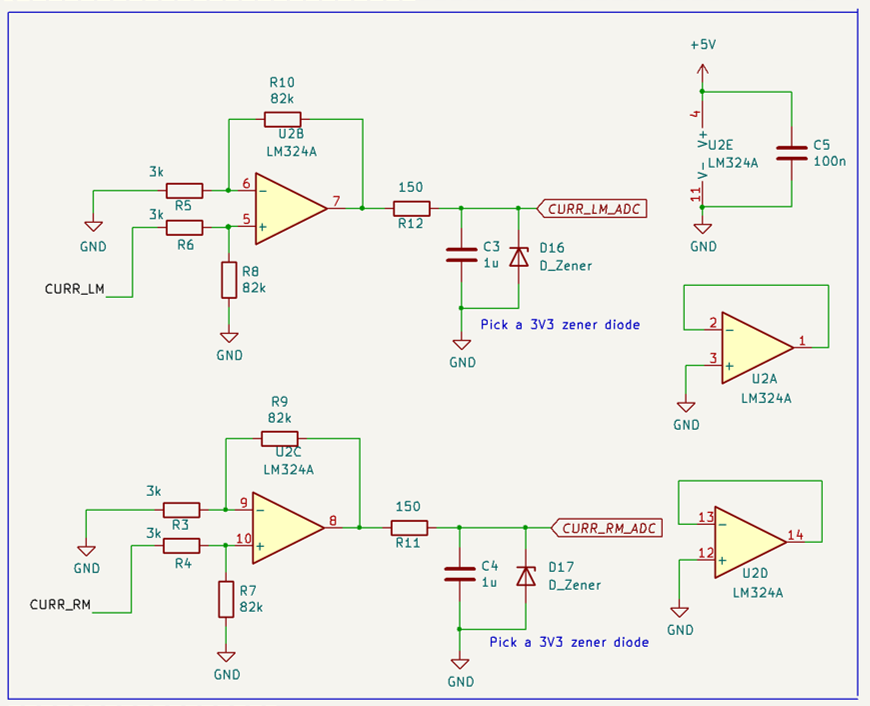
   
  <i>Figura 11: Esquemático do circuito de medição de corrente dos motores.</i>

O ganho dos amplificadores foi determinado de tal forma que a corrente máxima de torque dos motores que foram utilizados (1,1 A) fosse próxima dos 3 V, já que o ADC do ESP32-S3 possui fundo de escala de 3V3. Como o LM324 não é rail-to-rail, ele satura cerca de 1.5V abaixo do VCC​, com 5V de alimentação, a saída máxima real será de aproximadamente **3.5V**. o suficiente para a aplicação. Para tanto, o cálculo usando o amplificador não inversor foi:

  G=1+Rin​.Rfeedback​​=1+3k.82k​≈28,33.

Abaixo está uma tabela ilustrativa com exemplos de tensão e leitura do ADC.

| **Corrente do Motor** | **Tensão no Shunt** | **Saída do AmpOp** | **Valor no ADC (10-bit)** | **Status do Motor** |
| --------------------- | ------------------- | ------------------ | ------------------------- | ------------------- |
| $0.1\text{A}$         | $0.01\text{V}$      | $0.28\text{V}$     | $\approx 87$              | Sem carga           |
| $0.6\text{A}$         | $0.06\text{V}$      | $1.70\text{V}$     | $\approx 527$             | Eficiência Máxima   |
| **$1.1\text{A}$**     | **$0.11\text{V}$**  | **$3.11\text{V}$** | **$\approx 965$**         | **Stall (Travado)** |
Na saída do amplificador é colocado um filtro passa-baixa RC (150Ω e 1μF) para eliminar ruídos de chaveamento (PWM), e um diodo Zener de 3.3V para garantir que a saída nunca ultrapasse o limite do pino analógico do microcontrolador.

---
## *Encoders*

O Juca é capaz de receber os dois sinais advindos de um encoder incremental de quadratura. Isso é importante no cálculo de odometria do robô, onde é possível determinar o deslocamento angular da roda com base nos pulsos dos sinais gerados pelo encoder.

O encoder é acoplado à roda, que possui algum tipo de disco magnético (ou óptico) multi-polar que gira solidário ao eixo do motor.

Os sinais gerados pelo encoder são geralmente denominados Fase A e Fase B. De forma básica, existem dois sensores que medem a variação do campo magnético (ou a passagem de luz) e geram ondas quadradas defasadas entre si em 90°. Essa defasagem é o que permite ao sistema identificar não apenas a velocidade, mas também o sentido de rotação (horário ou anti-horário), dependendo de qual fase sofre a transição de nível primeiro (ver [Figura 12](#quad_enc_anima) e [Figura 13](#encoder_wave)).

  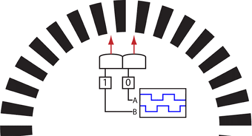
   
  <i>Figura 12: Ilustração do comportamento de um encoder de quadratura.</i>

  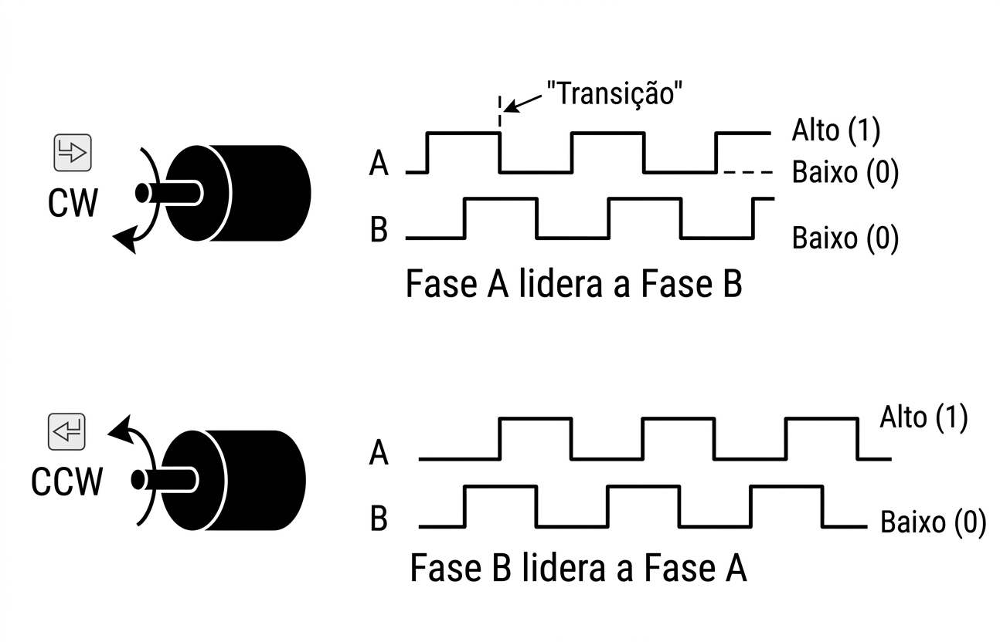
   
  <i>Figura 13: Comportamento do encoder para o sentido direto e reverso da roda.</i>

O encoder utilizado primariamente no Juca é o do motor apresentado na [Figura 10](#motor_wire), e possui os seguintes parâmetros:

| **Parâmetro**            | **Detalhe / Valor**                      |
| ------------------------ | ---------------------------------------- |
| **Relação de Redução**   | 1:34 (Exato: 1:34.02)                    |
| **Resolução do Encoder** | 341.2 PPR (Pulsos por Revolução da Roda) |
| **Cálculo da Resolução** | 11 pulsos (motor) x 34.02 (redução)      |
| **Comprimento Total**    | 73 mm (incluindo motor e eixo)           |

O motor elétrico gira muito rápido, mas com pouca força (torque). Por isso, ele possui uma **caixa de engrenagens** acoplada.

- **O que significa:** O motor interno precisa dar **34,02 voltas** completas para que a roda do robô dê apenas **1 volta**.
    
- **Vantagem:** Isso aumenta o torque do motor em 34 vezes, permitindo que o robô carregue peso e vença a inércia, além de reduzir a velocidade para algo controlável (280 RPM).

O encoder está montado no eixo do motor (antes da redução). O sensor lê **11 pulsos** a cada volta do motor interno.

- **O cálculo:** Como a roda só gira uma vez a cada 34,02 voltas do motor, multiplicamos: 11×34,02=341,22.
    
- **PPR (Pulsos por Revolução):** Este é o número que seu código usa para saber que o robô completou uma volta de roda. Se o microcontrolador contou 341 pulsos, o robô percorreu quase que exatamente uma distância igual à circunferência da sua roda.

Para saber como o ESP32-S3 trabalha com os pulsos de encoders acesse este conteúdo.

---
## Sensores de linha IR

---
## Sensores de distância ultrassônicos

---
## IMU

---
## Interface de expansão

---
## Mapeamento de pinos (Pinout)

### Controle de motores, *encoders* e sensores de corrente

| Recurso         | Pino (GPIO) | Tipo/Interface  | Descrição                            |
| --------------- | ----------- | --------------- | ------------------------------------ |
| **MOT_IN1**     | GPIO11      | Saída (PWM)     | Motor esquerdo - sentido A           |
| **MOT_IN2**     | GPIO10      | Saída (PWM)     | Motor esquerdo - sentido B           |
| **MOT_IN3**     | GPIO13      | Saída (PWM)     | Motor direito - sentido A            |
| **MOT_IN4**     | GPIO12      | Saída (PWM)     | Motor direito - sentido B            |
| **ENC1_A**      | GPIO7       | Entrada PCNT    | Encoder motor direito - canal A      |
| **ENC1_B**      | GPIO6       | Entrada PCNT    | Encoder motor direito - canal B      |
| **ENC2_A**      | GPIO14      | Entrada PCNT    | Encoder motor esquerdo - canal A     |
| **ENC2_B**      | GPIO21      | Entrada PCNT    | Encoder motor esquerdo - canal B     |
| **CURR_LM_ADC** | GPIO2       | Analógico (ADC) | Leitura de corrente - motor esquerdo |
| **CURR_RM_ADC** | GPIO9       | Analógico (ADC) | Leitura de corrente - motor direito  |
### Sensores ultrassônicos

| Recurso         | Pino (GPIO) | Tipo/Interface               | Descrição                                                 |
| --------------- | ----------- | ---------------------------- | --------------------------------------------------------- |
| **SONAR_TRIG**  | GPIO42      | Saída Digital                | Gatilho para todos os sensores ultrassônicos (barramento) |
| **SONAR0_ECHO** | GPIO1       | Entrada (captura de entrada) | Pino de eco do sensor ultra. dir.                         |
| **SONAR1_ECHO** | GPIO4       | Entrada (captura de entrada) | Pino de eco do sensor ultra. centro                       |
| **SONAR2_ECHO** | GPIO5       | Entrada (captura de entrada) | Pino de eco do sensor ultra. esq.                         |
### Sensores de linha IR

| Recurso             | Pino (GPIO) | Tipo/Interface | Descrição                               |
| ------------------- | ----------- | -------------- | --------------------------------------- |
| **IR_LEFT**         | GPIO25      | Digital        | Sensor de Linha / Obstáculo esquerda    |
| **IR_CENTER_LEFT**  | GPIO33      | Digital        | Sensor de Linha / Obstáculo centro esq. |
| **IR_MIDDLE**       | GPIO32      | Digital        | Sensor de Linha / Obstáculo centro      |
| **IR_CENTER_RIGHT** | GPIO35      | Digital        | Sensor de Linha / Obstáculo centro dir. |
| **IR_RIGHT**        | GPIO34      | Digital        | Sensor de Linha / Obstáculo direita     |

### IMU

| Recurso     | Pino (GPIO) | Tipo/Interface | Descrição                             |
| ----------- | ----------- | -------------- | ------------------------------------- |
| **MCU_SDA** | GPIO40      | I2C            | Dados Barramento I2C (IMU / Expansão) |
| **MCU_SCL** | GPIO39      | I2C            | Clock Barramento I2C (IMU / Expansão) |
| **IMU_INT** | GPIO41      | Entrada/IRQ    | Interrupção da IMU (MPU-6050)         |

### Expansão (pinos sobressalentes para conexão de outros módulos externos)

| Pino (GPIO)  | Pino (GPIO) | Pino (GPIO) | Pino (GPIO) | Pino (GPIO)  |
| ------------ | ----------- | ----------- | ----------- | ------------ |
| GPIO3        | GPIO35      | GPIO36      | GPIO37      | GPIO38       |
| GPIO45       | GPIO46      | GPIO47      | GPIO48      | SDA (GPIO40) |
| SCL (GPIO39) | TXD0        | RXD0        |             |              |

---

  